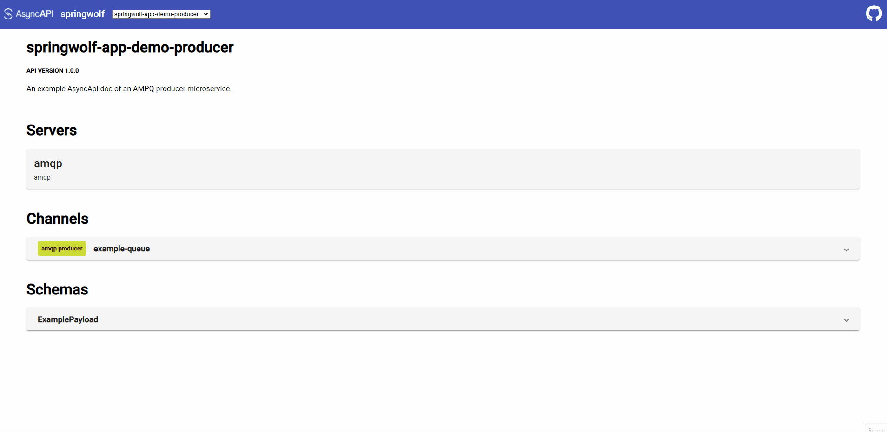

[](https://opensource.org/licenses/Apache-2.0)

# Springwolf App

## Table Of Contents
- [About](#about)
- [Usage](#usage)
- [Examples](#examples)
- [Limitations](#limitations)
- [Future Plans](#future-plans)

## About
Springwolf App is a service that allows the user to view multiple async API docs and use the APIs in one place.



### Background
As users of async APIs we often need to publish a message manually - but doing so is not very convenient. We need to:
1. Find and view the async API document (if there is one)
2. Find out all the details about the server (how to connect) and channel (name, payload schema, etc.)
3. Go to a different tool (many times a complex CLI)
4. Structure those details to a command (which is often complex as well)

*But why do it manually? It can be done automatically with the details described in the async API document!*

### Solution
And this is exactly what Springwolf App does when you provide it with your async API documents:
1. It generates a web UI for all your docs in one place (where you can choose which doc to display).
2. It has predefined producers for a variety of protocols (currently only kafka and amqp, but more will be added)
   that can connect to the server with the information supplied in the async API doc.
3. It allows you to publish messages directly from the UI to the channels described in the async API doc.

**View the API details and use it in the same place.**

The app itself is released as docker image to be included in your orchestration, allowing both easy CI/CD of your docs
and easy access to the developers and consumers of the APIs.

## Usage
1. Create a directory for your async api files - it should contain only async api files.
2. Add your async api files to directory. The files may be of either `json` or `yaml` format. See async api file limitations. 
3. Run Springwolf App using one of the methods below (jar, docker or docker compose)
4. Visit `localhost:<port>/asyncapi-ui.html` to view the UI.
5. If there is a running instance of an async api server (such as kafka or amqp), you can also publish messages as defined in the files.

Please see the [Examples](#examples) session for full docker compose examples.

### Jar
- The jar can be found in [Releases](https://github.com/springwolf/springwolf-app/releases).
- Use java 11 or higher.
```shell
$ java -jar springwolf-app-0.0.1.jar \
  --files-dir=<absolute path to async api files directory> \
  --server.port=<port>
```

### Docker
```shell
$ docker run --rm -it \
  -v <absolute path to async api files directory>:/app/docs \
  -p <host port>:8080 \
  stavshamir/springwolf-app:0.0.1
```

### Docker Compose
Add the following service under `service` in your `docker-compose.yaml`:
```yaml
springwolf-app:
  image: stavshamir/springwolf-app:0.0.1
  links:
    - <protocol server host name>
  volumes:
    - ./files:/app/docs
  ports:
    - "<host port>:8080"
```

## Examples
Examples are provided for kafka and amqp protocols. Click the following links for detailed README for each example:
- [amqp](https://github.com/springwolf/springwolf-app/tree/master/examples/amqp)
- [kafka](https://github.com/springwolf/springwolf-app/tree/master/examples/kafka)

## Limitations
### Async Api Docs
- Each doc must have a unique title
- While there are many ways to write an async api doc, the currently supported format is quite strict:
  - Please don't use message references (`$ref`), but do use schema references. See [Examples](#examples).
  - In order for the producers to work, please add bindings (even if empty) to the operation with the protocol name as key.
for example, an amqp operation should look like this:
```yaml
example-queue:
  publish:
    bindings:
      amqp: { }
    message:
      ...
```

### Protocols
- All protocol can be loaded to the UI, but producers are available only for kafka and amqp
- amqp producers do not support security, so please do not set a username and password

## Future Plans
- Integration with [springwolf-core](https://github.com/springwolf/springwolf-core)
- Better error handling
- Support more protocol producers (only kafka and amqp at the moment)
- Support more flexible async api structures